

# Kitboga Code Jam 2026 Submission

## Clash'N Skip — Ads Away

**Demo:** https://gm-doc.github.io/ClashNSkip/

A browser game disguised as an ad. Aliens are attacking your Skip Ad button - shoot them down, earn cash, and spend it on a ridiculous arsenal of weapons and ship upgrades before time runs out. Survive all four waves and top out your highscore in endless mode. Protect your skip button at all costs!

---

## Table of Contents

- [Enemies](#enemies)
  - [UFOs](#ufos)
  - [Space Bugs](#space-bugs)
- [Weapons](#weapons)
  - [Rifles](#rifles)
  - [Shotguns](#shotguns)
  - [Lasers](#lasers)
  - [Pulse Guns](#pulse-guns)
  - [Electric Weapons](#electric-weapons)
  - [Flamethrowers](#flamethrowers)
  - [Rockets](#rockets)
  - [Nuclear Weapons](#nuclear-weapons)
  - [Syringes](#syringes)
  - [Mayo](#mayo)
- [Ship Upgrades](#ship-upgrades)
  - [Armor](#armor)
  - [Engines](#engines)
  - [Self-Destruct](#self-destruct)
  - [Protection Systems](#protection-systems)

---

## Enemies

### UFOs

UFOs fly in streight lines and can gather in formations to get the speed bonus.

---

#### UFO

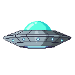

Baseline saucer. Goes down in a single hit. The most common enemy in early waves - do not underestimate a large group of them.

| HP | Speed | Score |
|----|-------|-------|
| 1  | 0.65  | $150  |

---

#### Heavy UFO

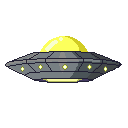

Tankier frontline saucer with lower speed and higher durability. Common from Level 2 onward.

| HP | Speed | Score |
|----|-------|-------|
| 2  | 0.55  | $250  |

---

#### Elite UFO

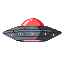

High-threat saucer with strong durability and a healthy score reward. Dominant in Level 4. Takes three hits to destroy.

| HP | Speed | Score |
|----|-------|-------|
| 3  | 0.60  | $500  |

---

#### Scout UFO

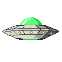

Fast UFO that can randomly appear on any level - great to get some extra cash bonus.

| HP | Speed | Score |
|----|-------|-------|
| 1  | 1.5   | $1000 |

---

#### UFO Mothership

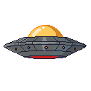

Boss-tier carrier — nearly double the size of a standard UFO. Can drop additional enemies mid-flight.  Five hits to destroy, moves deceptively fast for its size.

| HP | Speed | Score |
|----|-------|-------|
| 5  | 0.9   | $1000 |

---

### Space Bugs

An organic enemy family. Bugs have more randomized movement patterns making them harder to hit and Mother Bugs lay eggs that can hatch into more bugs mid-battle.

---

#### Bug

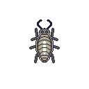

Common bug unit with moderate speed. Spawned as a small juvenile that grows to full size over ~3 seconds. Arrives in swarms from Level 2 onward. Two hits to kill.

| HP | Speed | Score |
|----|-------|-------|
| 2  | 0.8   | $150  |

---

#### Mother Bug

Larger, slower bug that periodically lays eggs as it moves. Prioritize these — every egg they drop can hatch into more bugs or more mothers.

| HP | Speed | Score | Egg Interval |
|----|-------|-------|--------------|
| 3  | 0.55  | $300  | 2s           |

---

#### Egg

Stationary hatch object dropped by Mother Bugs. Cracks open after 3 seconds — 80% chance to hatch a Bug, 20% chance to hatch a Mother Bug. One shot to destroy. Always worth the bullet.

| HP | Score | Hatch Time | Hatch Result |
|----|-------|------------|--------------|
| 1  | $50   | 3s         | Bug 80% / Mother Bug 20% |

---

## Weapons

Primary weapons are front-mounted and aimed with your cursor (left click). Secondary weapons fire from wing mounts (right click).

---

### Rifles

#### Rifle — Free

Default front-mounted rifle. Reliable friend that every pilot should have in their arsenal.

| Fire Rate | Clip | Reload | Damage |
|-----------|------|--------|--------|
| 0.5s      | 10   | 2s     | 1      |

---

#### Dual Rifle — $1,000

Double the rifles, double the fun, cheap and effective way to increase your firepower and shred through enemies faster.

| Fire Rate | Clip | Reload | Shots | Damage |
|-----------|------|--------|-------|--------|
| 0.5s      | 30   | 1s     | 2x    | 1      |

---

#### Minigun — $5,000

Rotary cannon with rapid fire rate, high ammo capacity and bigger bullets. Unleash a storm of lead to mow down enemies.

| Fire Rate | Clip | Reload | Damage |
|-----------|------|--------|--------|
| 0.17s     | 50   | 1s     | 2      |

---

### Shotguns

#### Shotgun — $1,000

Wide pellet spread for close defense and crowd trimming when enemies close the distance.

| Pellets | Spread | Clip | Reload |
|---------|--------|------|--------|
| 5       | 20deg  | 8    | 2s     |

---

#### Improved Shotgun — $5,000

Denser burst pattern with improved shell count, built to erase clustered targets faster.

| Pellets | Spread | Clip | Reload |
|---------|--------|------|--------|
| 7       | 25deg  | 15   | 1.5s   |

---

#### Elite Shotgun — $10,000

Heavy shotgun that floods the lane with pellets and punishes swarm pushes.

| Pellets | Spread | Clip | Reload |
|---------|--------|------|--------|
| 12      | 30deg  | 25   | 1s     |

---

### Lasers

#### Laser Gun — $5,000

High-velocity beam that pierces through enemies for strong single-lane control.

| Speed | Pierce | Clip | Reload | Fire Rate |
|-------|--------|------|--------|-----------|
| 16    | Yes    | 30   | 2s     | 0.25s     |

---

#### Dual Laser Gun — $15,000

Refined dual-laser system with faster cooldown and better ammo capacity for sustained piercing power.

| Speed | Pierce | Clip | Reload | Shots |
|-------|--------|------|--------|-------|
| 16    | Yes    | 50   | 2s     | 2x    |

---

### Pulse Guns

#### Pulse Rifle — $5,000

Compressed pulse rifle that fires slow, heavy energy rounds that pass through enemies for strong lane control.

| Orb Radius | Speed | Pierce | Clip | Reload | Damage |
|------------|-------|--------|------|--------|--------|
| 6px        | 4     | Yes    | 5    | 2s     | 1      |

---

#### Pulse Cannon — $10,000

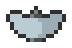

Amplified pulse emitter with larger shots and higher damage - great for control over grouped threats.

| Orb Radius | Speed | Pierce | Clip | Reload | Damage |
|------------|-------|--------|------|--------|--------|
| 12px       | 4     | Yes    | 10   | 2s     | 2      |

---

#### Tinfoil Cat Gun — $20,000

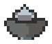
Tinfoil Cat Launcher that fires massive piercing energy cats. Unmatched for clearing lanes and punishing clustered enemies.

| Orb Radius | Speed | Pierce | Clip | Reload | Damage |
|------------|-------|--------|------|--------|--------|
| 28px       | 4     | Yes    | 20   | 2s     | 3      |

---

### Electric Weapons

#### Home-brew Microwave Emitter — $5,000

Microwave gun that shoots arcs of electricity to nearby targets. Great for hitting enemies without aiming.

| Targets | Range | DPS | Battery | Recharge |
|---------|-------|-----|---------|----------|
| 2       | 350px | 2.0 | 10s     | 2s       |

---

#### Multi-target Microwave Weapon — $7,500

Bigger microwave for bigger electricity arcs and more targets. Still no aiming needed, just point in the general direction and let it zap.

| Targets | Range | DPS | Battery | Recharge |
|---------|-------|-----|---------|----------|
| 3       | 380px | 2.5 | 20s     | 2s       |

---

#### Advanced Microwave Gun — $15,000

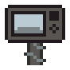

Powerful microwave capable of disrupting entire waves of heavy enemies (do not use your phone around it).

| Targets | Range | DPS | Battery | Recharge |
|---------|-------|-----|---------|----------|
| 4       | 400px | 3.5 | 40s     | 2s       |

---

### Flamethrowers

#### Flamethrower — $5,000

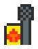

Short-range flame cone that scorches enemies directly ahead.

| Range | Cone | DPS | Battery | Reload |
|-------|------|-----|---------|--------|
| 250px | 22deg| 4.5 | 8s      | 3s     |

---

#### Blue Flamethrower — $15,000

High-output blue plasma flamethrower with extended range and increased damage per second.

| Range | Cone | DPS | Battery | Reload |
|-------|------|-----|---------|--------|
| 320px | 30deg| 7.5 | 12s     | 3s     |

---

### Rockets

#### Rockets — $1,000

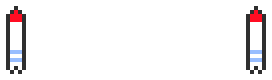

Wing-mounted rockets. Great for clearing heavier enemies or groups.

| Clip | Blast Radius | Reload |
|------|--------------|--------|
| 2    | 120px        | 8s     |

---

#### Rockets 2 — $3,000

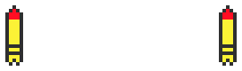

Improved rockets with higher velocity and wider blast radius. Bigger, better, bolder.

| Clip | Blast Radius | Reload |
|------|--------------|--------|
| 2    | 160px        | 8s     |

---

#### Rockets 3 — $7,500

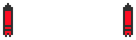

Best rockets for maximum destruction and area control.

| Clip | Blast Radius | Reload |
|------|--------------|--------|
| 2    | 200px        | 8s     |

---

#### Rocket Launcher — $5,000

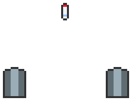

Wing-mounted launcher with a deep clip of small explosive rockets. Fast fire, long reload.

| Clip | Blast Radius | Reload |
|------|--------------|--------|
| 12   | 120px        | 15s    |

---

### Nuclear Weapons

#### Little Boy — $15,000

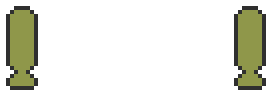

Long-range nuclear device. One well-placed shot clears an entire wave with a massive blast radius.

| Clip | Blast Radius | Reload | Speed |
|------|--------------|--------|-------|
| 2    | 240px        | 20s    | 2     |

---

#### Big Papa — $25,000

Huge blast radius, long cooldown, fire once and go sunbathing while the enemies burn.

| Clip | Blast Radius | Reload | Speed |
|------|--------------|--------|-------|
| 2    | 460px        | 20s    | 2     |

---

### Syringes

#### Moon Oil Syringe — $5,000

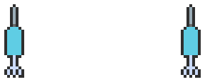

Moon-oil filled syringe that freezes enemies in place and leaves them vulnerable to shattering damage.

| Clip | Blast Radius | Freeze | Acid DPS | Reload |
|------|--------------|--------|----------|--------|
| 2    | 260px        | 5s     | -        | 10s    |

---

#### Corrosive Syringe — $10,000

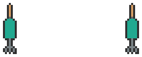

Upgraded syringe loaded with corrosive moon-oil. Freezes enemies and burns them with acid over time.

| Clip | Blast Radius | Freeze | Acid DPS | Reload |
|------|--------------|--------|----------|--------|
| 2    | 260px        | 5s     | 0.5      | 10s    |

---

### Mayo

#### Mayo Sprayer — $7,000

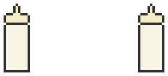

Mayo sprayer that slows enemies in a wide cone and leaves a sticky mess all over the battlefield.

| Range | Cone | Slow | Acid DPS | Battery | Reload |
|-------|------|------|----------|---------|--------|
| 270px | 25deg| 4s   | -        | 8s      | 5s     |

---

#### Wasabi Mayo — $15,000

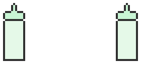

Upgraded wasabi mayo launcher with wider spray and corrosive burn that deals damage over time.

| Range | Cone | Slow | Acid DPS | Battery | Reload |
|-------|------|------|----------|---------|--------|
| 300px | 25deg| 5s   | 0.5      | 10s     | 5s     |

---

## Ship Upgrades

Permanent improvements purchased in the **Ship Systems** tab of the Upgrade Shop.

---

### Armor

Absorbs direct hits to your ship.

| Level | Name | Cost | Hits |
|-------|------|------|------|
| 1 | Default Armor | Free | 1 - standard hull plating |
| 2 | Heavy Armor | $5,000 | 2 - reinforced steel plating |
| 3 | Elite Armor | $10,000 | 3 - military-grade armor alloy |

---

### Engines

Improves your ship's movement and turning speed.

| Level | Name | Cost | Speed Multiplier |
|-------|------|------|------------------|
| 1 | Jet Engines | Free | 1x - standard ion thrusters |
| 2 | Additional Engines | $2,500 | 1.25x - extra pods for lateral thrust |
| 3 | Side Thrusters | $5,000 | 1.5x - full thruster array, maximum agility |

---

### Self-Destruct

When your ship is destroyed it automatically detonates, taking nearby enemies with it.

| Level | Name | Cost | Blast Radius |
|-------|------|------|--------------|
| 1 | Default Module | Free | 175px |
| 2 | Wired TNT | $5,000 | 262px |
| 3 | Wired Little Boy | $15,000 | 350px - nuclear-grade warhead |

---

### Protection Systems

One-time purchases that actively defend your skip button. Each reloads automatically after being consumed.

---

#### Each & Everything — $2,000

Trustworthy protection system that will block up to 3 enemies. Reloads in 30s.

Deploys a Windows 95-style popup on screen. Any enemy that collides with it is instantly destroyed. Blocks **3 hits**, then reactivates after **30 seconds**.

---

#### WWWWTSACTP — $5,000

*World Wide Web Wide Threat Shielding and Countermeasure Tactical Protocol.* Deploys a protective portable pop-up shield that takes out enemies and reloads 30s after destruction.

A dancing popup that actively moves around the screen and destroys up to **5 enemies** in its path. While active it commandeers the audio system. Reloads **30 seconds** after being fully consumed.

---

#### Seraph Secure — $10,000

Protects your skip button for you and renews at no additional cost.

An energy dome that wraps your skip button and intercepts incoming enemies. Holds **3 hits**, regenerates 1 hit per second when damaged. Reactivates **30 seconds** after being fully destroyed.

---

## Levels

| Level | Description |
|-------|-------------|
| 1 | Intro wave. Mostly basic UFOs with occasional Heavy UFOs. |
| 2 | Mixed pressure: Heavy UFOs dominate, first Bug encounters appear. |
| 3 | Bug-dominant. Swarms of Bugs and Mother Bugs with Elite UFO support. |
| 4 | Late-game. Elite UFOs and UFO Motherships with bug support. Tighter spawn timing. |
| Endless | All enemy types, increasing difficulty, no end. |

Enemies can also arrive in **formations** — line sweeps (5–10 units), V-formations, and boss orbits where a large enemy is flanked by circling minions.

---

## Credits

Built for the **Kitboga Code Jam 2026**.
Music: *Interstellar Anomaly* by Psychronic.

